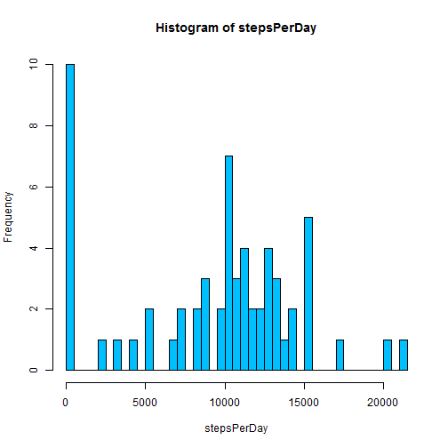
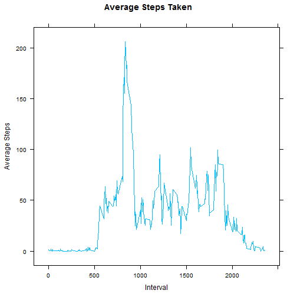
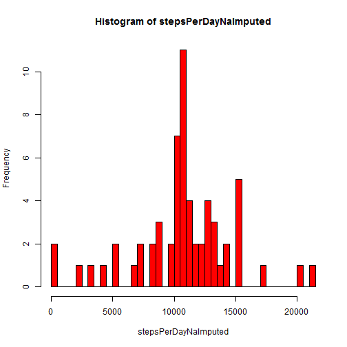
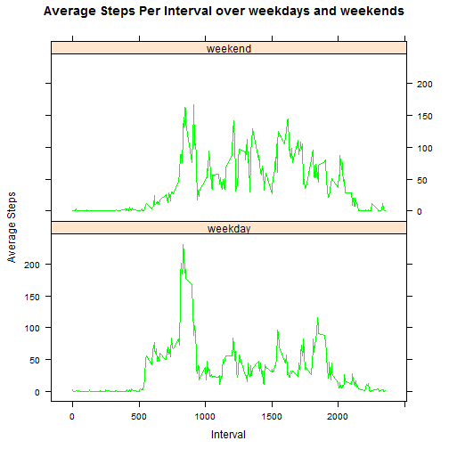

## Loading and preprocessing the data
This project code assumes only that the **csv** file is in the same folde as this Rmd file.
The data is in the form of a csv file inside a zip folder. So, the following steps have been followed to load the data.
1. Unzip the file
2. Read the ensuing csv file using read.csv


```r
library(dplyr)
library(lattice)

unzip("activity.zip")
activityData <- read.csv("activity.csv", header = TRUE)
print(head(activityData))
```

```
##   steps       date interval
## 1    NA 2012-10-01        0
## 2    NA 2012-10-01        5
## 3    NA 2012-10-01       10
## 4    NA 2012-10-01       15
## 5    NA 2012-10-01       20
## 6    NA 2012-10-01       25
```

## What is mean total number of steps taken per day?
1. The total number of steps per day can be found by running *tapply()* on *steps* over the margin *date*. To ensure that missing values are not considered, na.rm has been set to TRUE


```r
stepsPerDay <- tapply(activityData$steps, activityData$date, sum, na.rm = TRUE)
```

2. The histogram, basically, is a frequency chart of the number of steps per day. To plot the histogram, first the number of levels of dates (which is a factor), are found.This is just to get the number of bins needed in the histogram.Then, the histogram of *stepsPerDay* is plotted.


```r
lenDates <- length(levels(activityData$date))
hist(stepsPerDay, lenDates, col = "deepskyblue")
```



3. The mean value of steps per day, is just the mean of the *stepsPerDay* variable. The median is also found below.


```r
meanStepsPerDay <- mean(stepsPerDay)
printMean <- paste("Mean Steps per day = ", meanStepsPerDay)
cat(printMean)
```

```
## Mean Steps per day =  9354.22950819672
```

```r
medianStepsPerDay <- median(stepsPerDay)
printMedian <- paste("Median of Steps Per Day is ", medianStepsPerDay)
cat(printMedian)
```

```
## Median of Steps Per Day is  10395
```

## What is the average daily activity pattern?
This consists of the time series plot and finding the 5-minute interval of maximum activity.
1. The time series plot of the 5 minute interval is plotted by first calculating the mean steps in every 5 minute interval across all days, usint *tapply()* applied over the *interval* margin.
Then, a lattice plot is created using *xyplot*. This is then printed.


```r
meanStepsInterval <- tapply(activityData$steps, activityData$interval, mean, na.rm = TRUE)
ltplot <- xyplot(meanStepsInterval ~ activityData$interval, type = "l", col = "deepskyblue", xlab = "Interval", ylab = "Average Steps", main = "Average Steps Taken")
print(ltplot)
```



2. Next, the 5 minute interval with maximum time average no. of steps is caluclated by finding the index corresponding to the max of *meanStepsInterval* and then finding the corresponding  interval.


```r
maxIndex <- match(max(meanStepsInterval), meanStepsInterval)
intervalMaxSteps <- activityData$interval[maxIndex]
```

The 5 minute interval with the average maximum number of steps is the 104th interval.
This corresponds to the time period 835. It must be noted, however, that every 12th 5 minute interval is a multiple of 100 (i.e., 55-60 is 100, 155-160 is 200), indicating 1 hour, 2 hours, etc.

## Imputing missing values
1. The total number of missing values is just the *sum()* of the output of *is.na()* with the dataframe passed as the argument to *is.na()*. The code below prints it out.


```r
numNA <- sum(is.na(activityData))
rawDataDetails <- paste0("Number of NAs in Raw Data = ", numNA)
cat(rawDataDetails)
```

```
## Number of NAs in Raw Data = 2304
```

2. To impute missing values, the mean, across all days for every 5 minute interval has been taken and this has been taken as the steps for that particluar interval for each missing value.
The logic used here is exactly the same as the one used for calculating *meanStepsInterval*.
Further, since the number of missing values is an exact multiple of the number of entries in each day, the mean values are diectly equated to the rows having missing values. The following code does it.

3. Since a new dataframe has to be created, the original dataframe, *activityData* has first been replicated into a new dataframe *activityDataNaImputed* and the imputing of NA values has been done on this new dataframe.


```r
activityDataNaImputed <- activityData
activityDataNaImputed$steps[is.na(activityDataNaImputed$steps)] <- meanStepsInterval
numNA2 <- paste("NAs in new dataframe = ", sum(is.na(activityDataNaImputed)))
cat(numNA2)
```

```
## NAs in new dataframe =  0
```
As verification, we can see that the number of NA values in the new DF is 0.

4. The plot below, is a histogram of the data newly generated, with the NA values imputed. The mean and median values of this data frame are also printed by the code-snippet below.

The logic used is exactly the same as the one used to plot the histogram when NA values were not imputed. Only, the variables are different.


```r
stepsPerDayNaImputed <- tapply(activityDataNaImputed$steps, activityDataNaImputed$date, sum)
hist(stepsPerDayNaImputed, lenDates, col = "red")
```



```r
meanStepsPerDayNaImputed <- mean(stepsPerDayNaImputed)
printMeanNaImputed <- paste("Mean Steps per day = ", meanStepsPerDayNaImputed)
cat(printMeanNaImputed)
```

```
## Mean Steps per day =  10766.1886792453
```

```r
medianStepsPerDayNaImputed <- median(stepsPerDayNaImputed)
printMedianNaImputed <- paste("Median of Steps Per Day is ", medianStepsPerDayNaImputed)
cat(printMedianNaImputed)
```

```
## Median of Steps Per Day is  10766.1886792453
```
Looking at the **mean** and **median** we can conclude that they are equal now, with the NA values having been replaced by the mean for that 5 minute interval throughout the time-period. This is because, the middle value (median), indeed is the mean due to the way the NAs have been imputed. So, the estimate used to impute NA values appears to be a good estimate.

## Are there differences in activity patterns between weekdays and weekends?
1. Create a new Factor variable with 2 levels "weekday"" and "weekend": First, a variable *dayOfWeek* has been created by converting the *date* column to a **date** class, using *as.Date(as.character(...))*. 
Then, this column (*dayOfWeek*) has been converted to a factor variable and then the levels have been create by equating the first 5 days to *weekday* and the last 2 days to *weekend*. It is not necessary that this is the best method to create a factor variable. It has been done for want of a better method. **Any better methods may pleas be suggested during the review.**


```r
activityDataNaImputed$dayOfWeek <- weekdays(as.Date(as.character(activityDataNaImputed$date),
                                                    format = "%Y-%m-%d"))

activityDataNaImputed$dayOfWeek <- factor(activityDataNaImputed$dayOfWeek) 
levels(activityDataNaImputed$dayOfWeek) <- list(weekday = "Monday", weekday = "Tuesday",
                                                weekday = "Wednesday", weekday = "Thursday",
                                                weekday = "Friday", weekend = "Saturday",
                                                weekend = "Sunday")
varLevels <- levels(activityDataNaImputed$dayOfWeek)
# The levels are printed below
cat(varLevels)
```

```
## weekday weekend
```

2. To make the panel plot in order to compare steps on weekday and weekend, the DF with the new column has been grouped by *interval* and the factor *dayOfWeek*. Now, summarizing this with *mean*  will give the mean steps taken in each interval, categorized on *weekday* and *weekend*. This summarized data is put in a new dataset *summaryActivity*. The column of this dataset containing the mean, is named as **meanSteps**
An xyplot (lattice plot) of this dataframe, categorized on *dayOfWeek* gives a panel plot, comparing the activity (steps) on weekdays and weekends. The follwoing code does this.


```r
activityDataNaImputed = tbl_df(activityDataNaImputed)
activityDataNaImputedByInterval <- group_by(activityDataNaImputed, interval, dayOfWeek)
summaryActivity <- summarize(activityDataNaImputedByInterval, mean(steps))
colnames(summaryActivity) <- c("interval", "dayOfWeek", "meanSteps")
summaryActivity$dayOfWeek <- as.factor(summaryActivity$dayOfWeek)
ltplotCompare <- xyplot(summaryActivity$meanSteps ~ summaryActivity$interval | 
                   summaryActivity$dayOfWeek,
                 type = "l", col = "green", layout = c(1, 2),
                 xlab = "Interval", ylab = "Average Steps",
                 main = "Average Steps Per Interval over weekdays and weekends")
print(ltplotCompare)
```


